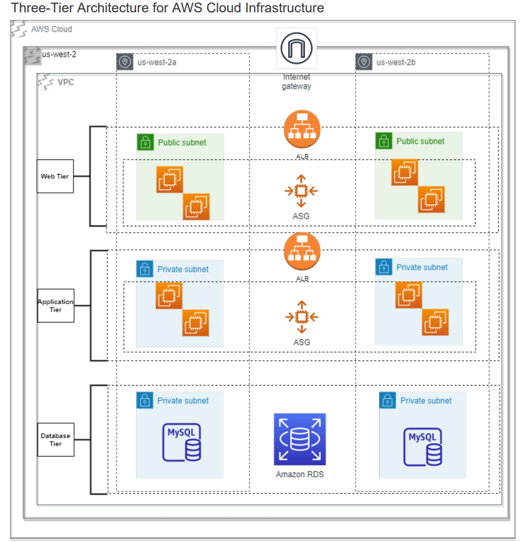

Multi-tier Web Application

In this design, I used Terraform to build a multi-tier web hosting environment. 

The Presentation Tier was built using a internet facing Application Load Balancer backed by an Auto-scaling group configured to host using Apache. 

The Application Tier was built using a internal Application Load Balancer backed by another Auto-scaling group. These resources are reside in private subnets and are only assessible from the ALB in the Presentation Tier. Software running you app for Business Logic can be used here. 

Finally the Datebase Tier was built using Amazon RDS and is setup to by Multi-AZ in the case of any failures or outages the replication database will be promoted to keep your application working as expected. 

AWS Resources used:
-VPC
-Application Load Balancer
-EC2
-RDS
-IAM

To run this lab you will first need to modify the variables listed in the following files:

Here you can modify your VPC configurations, cd in to:
 - vars\dev\vpc.tfvars

After modification cd into 
 - environments\dev\vpc 
 - use the following command to run script
 - terraform apply -var-file="../../../vars/dev/vpc.tfvars" --auto-approve
 
You will need to grab outputs of VPC module to create Application Load Balancer and Auto Scaling Group

Modify the following variables file to create internet facing ALB & ASG
- vars\dev\alb-asg-web.tfvars
- use VPC Modules output to complete configuration by updating subnets and VPC ID

After modification cd into
- environments\dev\alb-asg-web
- use the following command to run script
- terraform apply -var-file="../../../vars/dev/alb-asg-web.tfvars" --auto-approve

Modify the following variables file to create internal/private ALB & ASG
- vars\dev\alb-asg-web-app.tfvars
- use VPC Modules output to complete configuration by updating subnets and VPC ID

After modification cd into
- environments\dev\alb-asg-app
- use the following command to run script
- terraform apply -var-file="../../../vars/dev/alb-asg-app.tfvars" --auto-approve

Modify the following variables to launch RDS database 
- vars\dev\rds.tfvars
- use VPC modules  & ASG module to complete RDS network configuration

After modification cd into 
- environements\dev\rds
- use the following command to run script
- terraform apply -var-file="../../../vars/dev/backend.tfvars" --auto-approve

